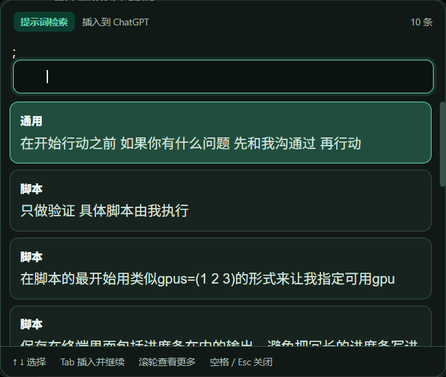
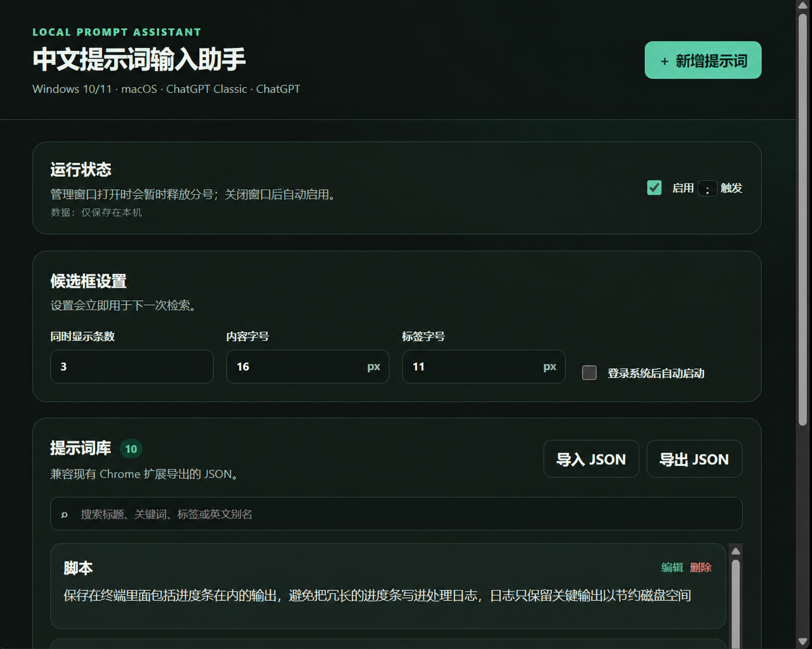

# 中文提示词输入助手 V0.1.4

> 在正在输入的位置按一个分号 `;`，搜索自己的提示词，按 `Tab` 插入——不用离开当前窗口，也绝不会自动发送。

<p align="center">
  
</p>

<p align="center"><em>输入 <code>;</code> 打开候选框，使用方向键选择、<code>Tab</code> 插入，滚轮查看更多。</em></p>

## 这是什么

中文提示词输入助手是一个完全在本地运行的桌面输入辅助工具，面向 Windows 10/11 与 macOS。它让提示词像输入法候选词一样出现在当前输入框附近，首批适配 **ChatGPT Classic** 和新版 **ChatGPT** 桌面客户端，也可以尝试在其他允许系统粘贴的普通输入框中使用。

它不是系统输入法，不会注册语言服务、读取对话内容或自动发送消息。提示词库和使用习惯保存在本机，选择提示词后只执行一次安全粘贴。

## 它解决什么问题

- **不用反复切换窗口：** 写提示词时不再打开文档、笔记或剪贴板来回查找。
- **提示词不再散落：** 标题、中文关键词、标签和英文别名统一管理，输入几个字就能找到。
- **连续组合更顺手：** 选完一条会预测下一条常用提示词，并自动添加分隔空格。
- **保留最终控制权：** 工具只负责插入文本，不模拟回车，发送前始终由你检查和确认。
- **隐私留在本机：** 提示词、设置和学习关系均使用本地文件保存，不上传到服务器。

## 怎么使用

1. 安装并启动应用，在管理界面新增提示词，或导入已有的 JSON 提示词库。
2. 把光标放回 ChatGPT 或其他目标输入框，键入半角或中文分号 `;`。
3. 继续输入文字搜索提示词；输入两个分号 `;;` 可以只按标签检索。
4. 使用 `↑` / `↓` 选择，按 `Tab` 插入；滚动鼠标滚轮可查看其余候选项。
5. 选择完成后按空格或 `Esc` 关闭候选框，焦点会回到原输入框。

<p align="center">
  
</p>

<p align="center"><em>在管理界面维护提示词，并调整候选数量、内容字号、标签字号和开机启动设置。</em></p>

## 下载

- [下载最新 Windows 安装包](https://github.com/Richen7418/prompt-input-assistant/releases/latest)
- 当前提供 Windows x64 安装包。安装包尚未进行商业代码签名，首次运行时可能出现 SmartScreen 提示。
- macOS 版本的代码已经实现，但仍需要在 macOS 设备上完成签名、打包和运行验收。

## V0.1.4 变化

- 每次插入提示词时，若正文末尾没有空白字符，会自动补一个半角空格，连续选择的提示词不会直接粘连。
- 如果提示词原本已经以空格或换行结尾，则不会重复追加空格。

## V0.1.3 变化

- 选过提示词后用空格或 `Esc` 关闭候选窗，会重新激活最初的目标输入窗口，不插入额外字符。
- `↑`、`↓` 和 `Tab` 由整个候选窗接管；鼠标悬停或点击过候选项后仍可继续键盘操作。
- “同时显示条数”只控制候选窗的可视高度；全部匹配项仍会保留，可用滚轮浏览，键盘选择会自动滚入视野。

## V0.1.2 变化

- 选择提示词后不再结束候选会话，而是清空检索词并预测下一条可能需要的提示词。
- 第一次打开时，候选项按照近期使用频率排序；较新的选择具有更高权重。
- 连续选择会学习实际提示词内容之间的顺序关系，例如经常选择 `A → B` 后，选择 A 会优先推荐 B；标签不会被当成学习关系。
- 提示词正文变化后，与旧正文有关的学习关系自动失效；只修改标题、关键词、标签或别名不会清除关系。
- 空格或 `Esc` 结束候选会话。已经选择过提示词时只关闭候选窗，不会额外插入分号。
- Windows 续选阶段若候选窗意外失焦，会临时把空格和 `Esc` 注册为关闭键；候选窗重新聚焦或关闭后立即释放，正常中文输入法组词不受影响。
- 修复插入第一条提示词后，空格或 `Esc` 偶尔无法关闭下一条预测窗口的问题。
- 学习结果完全保存在本机的独立聚合文件中；相同的 `A → B` 无论选择多少次都只占一条统计记录，不随提示词 JSON 导出。

## V0.1.1 修复

- 修复候选窗按 Tab 后，Windows 可能仍把焦点留在提示词助手并报告“自动粘贴失败”的问题。
- 隐藏候选窗前主动释放其焦点；恢复目标时同时校验窗口句柄和进程 ID，兼容 ChatGPT/ChatGPT Classic 的多进程窗口结构。

## V0.1 功能

- 本地新增、编辑、删除提示词
- 按标题、中文关键词、标签和英文别名检索
- `;关键词` 检索提示词；`;;标签` 仅检索标签字段
- 支持中文输入法 composition，不会在组词期间误选候选项
- 候选窗内用 `↑` / `↓` 选择，按 `Tab` 插入并继续显示下一组候选
- 空格或 `Esc` 关闭候选窗；尚未选择提示词时会还原原始检索文字，已经选择后只关闭
- 插入内容后绝不模拟 Enter，也不会自动发送
- 提示词正文、标签字号和同时显示条数可调；匹配结果超过可视条数时仍可继续滚动
- JSON 合并导入和完整导出，兼容 `prompt插件` 项目的导出格式
- 使用系统剪贴板粘贴，并在成功后恢复常见的文字、HTML、RTF、图片和书签内容
- 管理窗口关闭后常驻系统托盘，可暂停或重新启用分号触发
- 不加载远程脚本、样式、字体或页面

## 项目结构

```text
prompt-input-assistant/
├─ package.json
├─ assets/
│  ├─ icon.png
│  └─ screenshots/         # README 实际效果图
├─ README.md
├─ scripts/
│  ├─ static-check.js
│  └─ platform/
│     └─ windows-bridge.ps1
├─ src/
│  ├─ core/
│  │  ├─ insertion.js       # 插入文本尾部分隔处理
│  │  ├─ schema.js          # 数据校验及 Chrome 扩展 JSON 兼容
│  │  ├─ learning.js        # 聚合分数、衰减、迁移和关系淘汰
│  │  └─ search.js          # 中文、标签、别名检索及预测排序
│  ├─ main/
│  │  ├─ main.js            # 窗口、托盘、快捷键和 IPC
│  │  ├─ learning-store.js  # 独立 prompt-learning.json 持久化
│  │  ├─ platform.js        # Windows/macOS 焦点恢复与粘贴 adapter
│  │  ├─ clipboard.js       # 剪贴板快照与恢复
│  │  └─ store.js           # 本地 JSON 持久化
│  ├─ renderer/
│  │  ├─ manager.*          # 提示词管理和设置界面
│  │  └─ popup.*            # 输入法式候选窗口
│  └─ preload.js            # 最小化、安全的页面 API
└─ test/
   ├─ core.test.js
   └─ store.test.js
```

## 开发环境

需要安装：

- Node.js 22 或更高版本
- npm（Node.js 自带）
- Windows 10/11，或 macOS 14 及以上

项目不需要 React、Vue 或前端构建工具。界面是原生 HTML、CSS、JavaScript；Electron 只负责提供跨平台桌面窗口、托盘和系统能力。

## 启动开发版

在 PowerShell 或 macOS Terminal 中进入项目目录：

```powershell
git clone https://github.com/Richen7418/prompt-input-assistant.git
cd prompt-input-assistant
npm install
npm start
```

macOS 中请把第一行替换成该项目在 Mac 上的实际路径，例如：

```bash
cd "$HOME/Projects/prompt-input-assistant"
npm install
npm start
```

首次启动会打开提示词管理窗口。新增提示词，或者点击“导入 JSON”并选择 Chrome 扩展导出的文件。关闭管理窗口后应用不会退出，而是进入系统托盘并启用全局分号触发。

## macOS 首次授权

macOS 会限制应用恢复其他程序焦点和模拟粘贴。第一次使用自动粘贴时：

1. 打开“系统设置 → 隐私与安全性 → 辅助功能”。
2. 允许“中文提示词输入助手”；运行开发版时，也可能需要允许启动它的 Terminal。
3. 如果系统询问是否允许控制“System Events”，请选择允许。
4. 授权后完全退出并重新启动应用。

未授权时，提示词会保留在剪贴板中，需要手动按 `⌘V`。

## 使用方法

1. 打开 ChatGPT Classic 或新版 ChatGPT，并把光标放到消息输入框。
2. 按一次 `;`，候选窗口会出现在当前屏幕下方。
3. 直接输入中文关键词或英文别名；再输入一个 `;` 会切换到标签检索。
4. 使用 `↑` / `↓` 只移动候选高亮，不会移动 ChatGPT 输入框的光标。
5. 按 `Tab` 或点击候选项，插入完整提示词；候选窗会重新出现并预测下一条。
6. 可以继续检索和插入其他提示词，按空格或 `Esc` 关闭候选窗。
7. 用户检查内容后自行发送；应用不会自动发送。

如果单分号快捷键已被其他程序占用，状态页会提示使用备用快捷键 `Ctrl+;`（Windows）或 `⌘+;`（macOS）。管理窗口获得焦点时会主动释放全局分号，因此可以正常编辑包含分号的提示词；关闭管理窗口后重新注册。

### 输入普通分号

全局触发启用时，单独的 `;` 会打开候选窗口。如果本来只是想输入普通分号，可以按 `Esc`；应用会关闭候选窗口并把 `;` 还原到原输入框。也可以从托盘临时暂停分号触发。

## 导入现有 Chrome 扩展数据

1. 在原 Chrome 扩展侧边栏点击“导出 JSON”。
2. 打开本应用的提示词管理窗口。
3. 点击“导入 JSON”并选择刚才导出的文件。

支持以下两种顶层结构：

```json
{
  "format": "chatgpt-prompt-sidepanel",
  "version": 1,
  "prompts": [
    {
      "id": "唯一标识",
      "title": "润色中文邮件",
      "content": "请润色下面的中文邮件……",
      "keywords": ["润色", "邮件"],
      "tags": ["工作"],
      "aliases": ["polish", "email"],
      "createdAt": "2026-08-06T00:00:00.000Z",
      "updatedAt": "2026-08-06T00:00:00.000Z"
    }
  ]
}
```

也可以直接导入提示词对象数组。相同 `id` 会覆盖，不同 `id` 会追加；单文件上限 5 MB，提示词总数上限 5000 条。

## 数据位置与隐私

提示词保存在 `prompt-library.json`，本地学习结果单独保存在同一 `userData` 目录下的 `prompt-learning.json`。程序不联网同步、不记录全局按键内容，也不加载远程代码。导出 JSON 只包含提示词，不包含个人选择习惯。

学习文件保存聚合分数，而不是逐次选择日志。每次选择时按以下公式更新：

```text
新分数 = 旧分数 × 2 ^ (-距离上次更新的时间 / 半衰期) + 1
```

- 提示词全局常用度的半衰期为 14 天，用于首次打开候选框时排序。
- `A → B` 下一条关系的半衰期为 30 天，用于选择 A 后预测 B。
- 每个正文版本最多保留 10 个下一条关系；全局最多 10,000 条关系。
- 180 天未使用且当前有效分数低于 `0.05` 的记录会被清理。
- 正文修改后旧正文指纹相关的统计自动失效，标题或标签修改不影响学习结果。
- 旧开发版保存的最近 2000 次选择会在首次启动时自动、幂等地折算成聚合分数，随后从提示词库文件移除；迁移前的原文件会保留为 `.pre-aggregate-backup` 备份。

V0.1 只注册分号快捷键；分号打开候选窗后，查询文字输入在本应用自己的窗口里，而不是通过全局键盘记录获取。这个设计既能正确使用中文输入法，也避免持续采集其他应用中的键盘内容。

## 检查和测试

```powershell
npm run check
npm run smoke:electron
npm run smoke:app
```

- `npm run check`：检查必要文件、安全窗口选项、CSP、远程资源，并运行数据和检索单元测试。
- `npm run smoke:electron`：短暂启动 Electron，验证当前系统是否能注册 `;` 和备用快捷键，随后自动退出。
- `npm run smoke:app`：无界面加载管理页、候选页、托盘和平台桥接，验证完整应用初始化后自动退出。

## 打包

Windows 安装包必须在 Windows 上构建：

```powershell
npm run dist:win
```

macOS 安装包必须在 Mac 上构建：

```bash
npm run dist:mac
```

产物位于 `release`。当前 Windows 安装包没有商业代码签名，macOS 构建也没有签名或公证；从源码自行构建时，系统可能要求手动允许应用运行。

## 调试

- 管理界面：启动应用后按 `Ctrl+Shift+I`（Windows）或 `⌥⌘I`（macOS）。
- 候选窗口：运行 `npm run dev`，触发候选窗口后使用相同开发者工具快捷键。
- 主进程：查看启动应用的 PowerShell 或 Terminal 输出。
- 本地数据：应用状态中会显示 `prompt-library.json` 的完整路径。
- 修改代码后：完全退出托盘应用，再运行 `npm start`。仅关闭管理窗口不会退出主进程。

## 已知限制

- V0.1 在 Windows 上根据目标窗口边界把候选框放在窗口靠下居中位置；macOS 使用当前屏幕靠下居中位置。还没有在所有应用中精确跟随文字光标。
- ChatGPT Classic 和新版 ChatGPT 会更新内部实现。当前版本通过操作系统恢复应用窗口并粘贴，不依赖它们的动态 DOM/CSS，但仍需在两端分别人工验收。
- 管理窗口必须关闭到托盘后才会注册单分号，避免编辑提示词时劫持普通分号。
- Windows 不允许普通权限应用向管理员权限应用可靠注入文字；两边权限等级应保持一致。
- macOS 自动粘贴依赖“辅助功能/自动化”授权。
- 剪贴板会恢复常见格式；部分应用的私有剪贴板格式可能无法完整恢复。自动粘贴失败时，为避免丢失提示词，应用不会恢复旧剪贴板，而会保留待粘贴文本。
- 密码框和安全输入场景尚不能被跨平台可靠识别。V0.1 的首批目标仅为 ChatGPT Classic 与 ChatGPT；不要在密码输入期间触发助手。
- macOS 平台代码已实现并通过静态检查，但 Windows 环境无法执行 macOS 的运行时和打包验收，必须在 Mac 上完成最终验证。

## 开源许可

本项目使用 [MIT License](LICENSE)。
